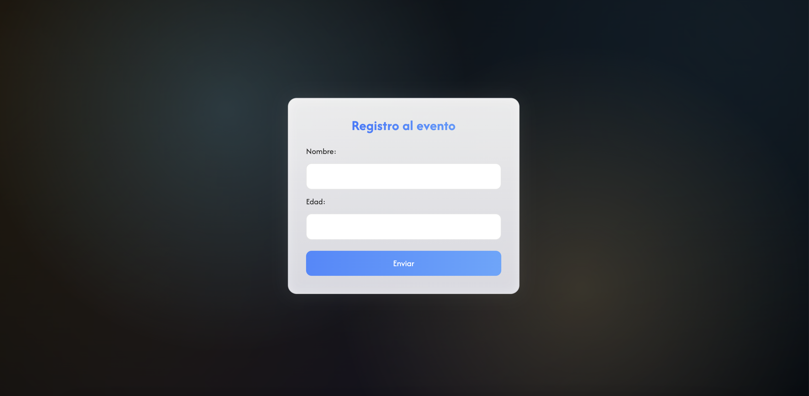
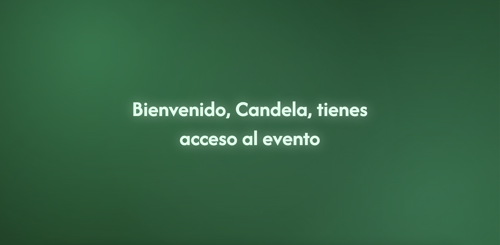
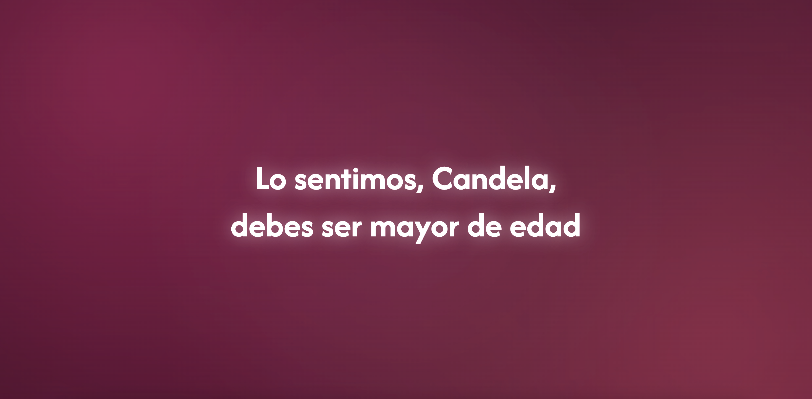

# Registro al evento — Formulario interactivo con validación

Proyecto de la **Unidad 2 del módulo "JavaScript esencial"**. Es un formulario que pide nombre y edad, valida con un operador de comparación si la persona es mayor de edad y muestra un mensaje dinámico en pantalla: una pantalla verde de bienvenida si cumple, o una roja si no.

## Demo online

El proyecto se encuentra publicado mediante GitHub Pages:

https://candelacorradin.github.io/ReactJS-Modulo1-Unidad2/

## Tecnologías

- HTML5
- CSS3 (animaciones, gradientes y clases dinámicas)
- JavaScript (DOM, eventos, `querySelector`, `addEventListener`, `preventDefault`)

## Cómo funciona

1. Se cargan los elementos del formulario con `document.querySelector`.
2. Al enviar, `addEventListener` ejecuta la función de validación y `event.preventDefault()` evita que la página se recargue.
3. Se obtiene la edad y, con el operador `>=`, se compara contra 18.
4. Según el resultado se muestra la pantalla correspondiente usando `classList.add()` y `classList.remove()`, con el nombre interpolado en el mensaje.

## Cómo clonar y ejecutar

No requiere dependencias ni instalación. Basta con abrir el `index.html` en el navegador.

```bash
git clone https://github.com/TU-USUARIO/registro-al-evento.git
cd registro-al-evento
```

Luego abrí `index.html` con doble clic, o serví la carpeta con cualquier servidor estático (por ejemplo `Live Server` en VS Code).

## Estructura

```
.
├── index.html      # Formulario y título principal
├── script.js       # Lógica de validación (variables, operadores, función, DOM, eventos)
├── styles.css      # Estilos base y clases dinámicas para los mensajes
├── screenshots/    # Capturas usadas en el README
└── README.md
```

## Capturas

**Formulario inicial**



**Mensaje positivo (mayor de edad)**



**Mensaje negativo (menor de edad)**



## Créditos

- **Autor:** Candela Corradin Tessa
- **Curso:** Desarrollo en React JS
- **Unidad:** Módulo 1 — Unidad 2

## Fuentes

- Google Fonts: https://fonts.google.com/
